# New Super Mario Mario 3D Q

Projet de Machine Learning pour l'apprentissage de Super Mario Bros par des méthodes de renforcement.

## L'apprentissage par renforcement

L'apprentissage par renforcement est une méthode de Machine Learning très différente des approches classiques. En effet, là où les apprentissages supervisés ou non ont besoin de données d'entraînement, les algorithmes de Reinforcement Learning apprennent tout seul à partir de leur environnement.

L'un des exemples les plus connus est l'algorithme AlphaGo développé par Google DeepMind qui a appris de lui-même à jouer au jeu de go qui est un jeu très complexe. En 2016 AlphaGo a même été capable de surpasser de loin Lee Sedol considéré alors comme étant le meilleur joueur au monde du jeu de go (les matchs opposant Lee Sedol à AlphaGo sont visibles [ici](https://www.youtube.com/watch?v=vFr3K2DORc8)).

Les algorithmes de renforcement peuvent donc devenir très performants sur des jeux dont les règles sont très compliquées. On pourrait donc facilement imaginer son application à des problèmes réels.

Comme énoncé précédemment, l'apprentissage par renforcement consiste à apprendre à un agent à se comporter dans un environnement, il va être récompensé s’il fait une bonne action et pénalisé dans le cas contraire. Ce mode de fonctionnement est très proche de ce que nous faisons dans la vie de tous les jours. Les données d'entraînement proviennent donc de l'environnement. Cet environnement peut être réel ou simulé. Par exemple, dans le cas d'AlphaGo, l'environnement d'entraînement a totalement été recréé virtuellement. Un exemple commun d'apprentissage dans un environnement réel est celui des voitures autonomes (un exemple très parlant d'apprentissage par renforcement dans un environnement réel pour apprendre à conduire à une voiture est visible [ici](https://www.youtube.com/watch?v=eRwTbRtnT1I)). Les environnements virtuels sont en général plus pratiques, car l'apprentissage y est plus aisé et plus rapide, mais ils ne reproduisent pas forcément tous aspects du monde réel. Enfin, le but de l'apprentissage par renforcement n'est pas de minimiser une fonction d'erreur comme dans les méthodes de Machine Learning classiques, mais plutôt de maximiser le nombre de récompenses actuelles et futures.

L'agent est donc plongé dans un environnement et va être amené à prendre des décisions en fonction de cet environnement. À chaque fois que l'agent prend une décision, l'environnement va lui renvoyer un état (le nouvel état de l'environnement après que l'agent ai effectué son action) ainsi qu'une récompense. Cette récompense peut être positive (si l'action est bénéfique), négative (si l'action est néfaste), ou neutre (si l'action n'a pas de répercutions).

Les interractions entre l'agent et l'environnement peuvent être résumées de la sorte :
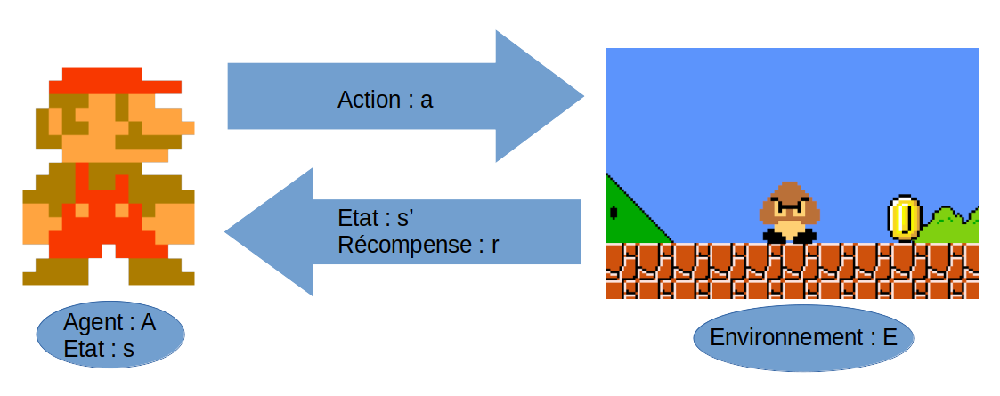

### Exemple simple

Voici un exemple très simpliste du principe de l'apprentissage par renforcement.

On considère un agent : Mario, et un environnement composé d'un Goomba (ennemi) et d'une pièce (objectif à atteindre).

Toute ressemblance avec des personnages ou des situations existantes ou ayant existé (notamment dans l'univers Nintendo) ne saurait être que fortuite.

Voici l'état initial :

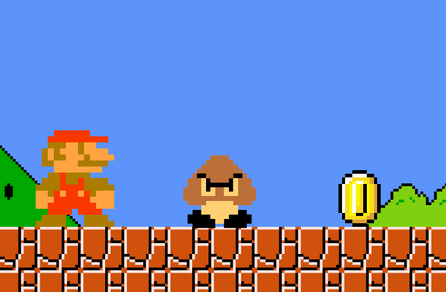

L'agent peut effectuer 3 actions distinctes :

- attendre
- avancer vers la droite
- sauter

On définit les gains comme suit :

- -1 si Mario touche le Goomba
- 1 si Mario atteint la pièce
- 0 sinon

L'objectif de l'agent est donc d'atteindre la pièce sans toucher le Goomba.

Dans un premier temps, on peut imaginer que l'agent va effectuer l'action "attendre" et donc ne pas bouger de son état initial, et donc obtenir un gain égal à **0**.

On considère ensuite que l'agent va avancer vers la droite :

|   Étape 1                                         |   Étape 2                                        |
|   :---------------------------------------------: |   :--------------------------------------------: |
|   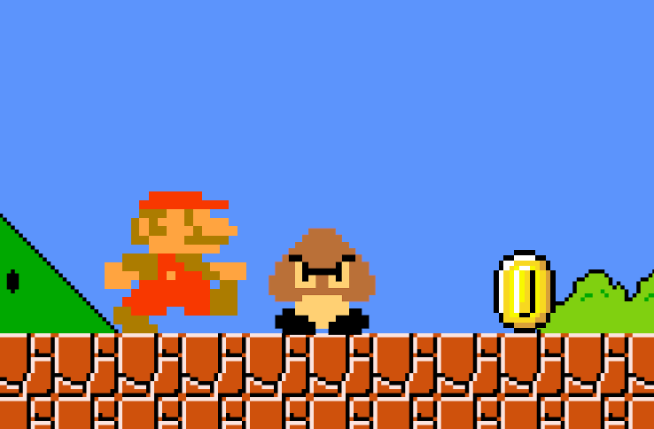   |   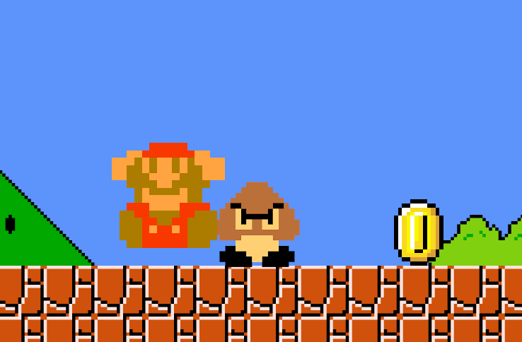  |

Mario va alors rencontrer le Goomba, et perdre une vie. L'environnement va donc lui renvoyer une récompense de **-1**.

Enfin, après avoir essayé les deux actions précédentes et n'ayant pas eu de retour fructueux, l'agent va essayer la troisième action possible, c’est-à-dire "sauter" :

|   Étape 1                                         |   Étape 2                                        |
|   :---------------------------------------------: |   :--------------------------------------------: |
|   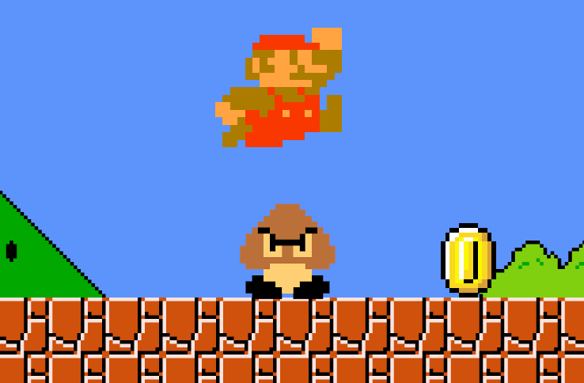   |   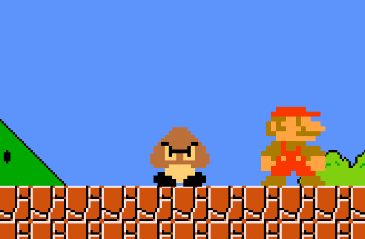  |

Cette fois-ci, Mario a réussi à atteindre la pièce, il reçoit donc une récompense égale à **1**.

À la suite de ces trois expériences, l'agent va privilégier l'action "sauter" car elle permet de maximiser le gain.

### Exploration vs exploitation

Les algorithmes d'apprentissage par renforcement possèdent deux phases différentes : la phase d'exploration et la phase d'exploitation.

Durant l'exploration, l'agent va prendre des actions aléatoires et noter les gains qu'il reçoit en effectuant ces différentes actions (ce qui s'apparente à la phase d'apprentissage).

Lors de l'exploitation, l'agent va effectuer les actions maximisant son gain à partir de ce qu'il a appris de ses explorations.

Cependant, il faut réussir à trouver un juste milieu entre l'explortion et l'exploitation. En effet, un algorithme ne faisant pas assez d'exploration pourrait se cantonner à une solution sous optimale, tandis qu'un algorithme ne faisant pas assez d'exploitation n'atteindrait jamais la solution.

Pour simplifier les choses, reprenons l'exemple de Mario.

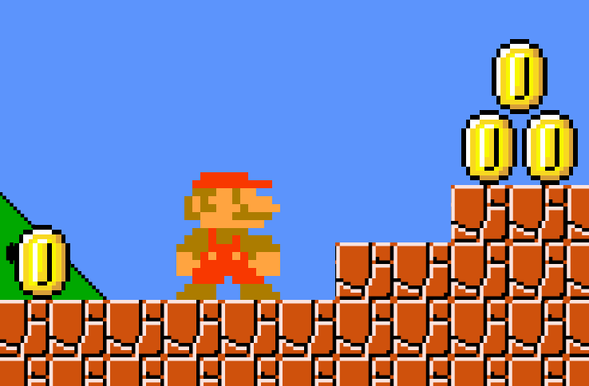

Cette fois-ci, Mario peut obtenir deux gains positifs : un gain de 1 s’il va à gauche et un gain de 3 s’il va à droite.

Si on fixe un nombre d'actions d'exploration petit, on pourrait imaginer que Mario va trouver la pièce de gauche (pour laquelle il lui suffit de se déplacer à gauche), mais ne va jamais atteindre celles de droite (car elles nécessitent plusieurs actions). Ainsi, lors de la phase d'exploitation, Mario va se contenter d'aller à gauche, ne maximisant pas son gain.


|   Solution sous-optimale      |   Solution optimale                                        |
| :--------------------------------------------------: | :--------------------------------------------: |
|  |  |

Ainsi, il existe plusieurs politiques d'exploration/exploitation.

La plus simple et aussi la moins efficace est la politique "greedy". L'agent va simplement choisir l'action maximisant son gain.

Une autre politique bien plus efficace est la politique nommée $`\epsilon`$-greedy. On fixe une valeur $`\epsilon`$ qui va représenter la proportion d'exploration. Par exemple, si on fixe $`\epsilon=0.9`$, on va faire 90% d'exploration et 10% d'exploitation.

Enfin, une autre politique très utilisée est nommée "decaying $`\epsilon`$-greedy". Le principe est exactement le même que pour la politique $`\epsilon`$-greedy, seulement, au bout d'un certain temps, on va faire diminuer petit à petit la valeur de $`\epsilon`$ pour arriver à un stade où l'on fait majoritairement de l'exploitation. Par exemple, on pourrait imaginer qu'on commence avec $`\epsilon=0.9`$ et qu'au bout du 100ᵉ épisode on commence à diminuer cette valeur de $`0.01`$ à chaque épisode jusqu'à ce que $`\epsilon=0.1`$.

### Value function

Pour savoir quelle action doit prendre l'agent en fonction de l'état de son environnement, il faut calculer la valeur de ces états. Cette valeur est calculée grâce à la value function.

La définition de cette value function dépend des algorithmes de Reinforcment Learning.

## L'algorithme Q-Learning

L'algorithme du Q-learning est l'un des algorithmes de renforcement les plus utilisé. Son nom vient de la fonction d'évaluation qui lui es associée : la Q-function.

### La Q-function

La Q-function mesure la qualité d'une action dans un état de l'environnement. Elle prend donc en paramètre l'état, mais aussi l'action que l'agent va effectuer.

Elle est définie de la sorte :

```math
Q(s_t, a_t)^{\pi} = \mathbb{E}[r_{t+1} + \gamma r_{t+2} + \gamma ^2 r_{t+3} + ...|s_t, a_t]
```

Avec :

- $`s_t`$ : l'état de l'environnement à l'instant $`t`$
- $`a_t`$ : l'action choisie à l'instant $`t`$
- $`r_{t}`$ : la récompense à l'instant $`t`$
- $`\gamma \in [0, 1]`$ : un facteur représentant à quel point on va prêter de l'importance aux récompenses sur le long terme (si $`\gamma \approx 1`$ on accorde autant d'importance aux récompenses futures qu'aux récompenses actuelles)
- $`\pi`$ : veut dire que l'agent choisi l'action optimale

On utilise l'espérance $`\mathbb{E}`$ afin de faire une moyenne, car l'environnement n'est pas forcément déterministe et peut varier au cours des expériences.

La valeur de la Q-function pour une action et un état donné est donc une moyenne des différentes récompenses possibles futures. 

### Q-function récursive

On peut redéfinir l'équation précédente de manière récursive avec l'équation de Bellman :

```math
Q(s_t, a_t)^{\pi} = r + \gamma max_{a_{t+1}} Q(s_{t+1}, a_{t+1})^{\pi}
```

Avec :

- $`r`$ : la récompense obtenue en prenant l'action $`a_t`$ dans l'état $`s_t`$
- $`\gamma`$ : de même que précédement
- $`max_{a_{t+1}} Q(s_{t+1}, a_{t+1})`$ : la valeur maximale de la Q-function à l'état $`t+1`$ en fonction de l'action

Cette équation est plus utile car définie de manière récursive.

### Update function

Au cours des époques d'apprentissages, on veut mettre à jour la valeur de cette Q-function. Pour cela, on utilise donc une fonction d'update qui est définie de la sorte :

```math
Q(s_t, a_t)_{new} = Q(s_t, a_t)_{old} + \alpha [r + \gamma max_{a_{t+1}}Q(s_{t+1}, a_{t+1}) - Q(s_t, a_t)_{old}]
```

Avec :

- $`max_{a_{t+1}}Q(s_{t+1}, a_{t+1}) - Q(s_t, a_t)_{old}`$ : la différence entre la valeur de la prochaine action (au temps $`t+1`$) et la valeur de l'action actuelle
- $`\gamma`$ : de même que précédemment
- $`r`$ : de même que précédemment
- $`\alpha`$ : le learning rate (afin de pouvoir moyenner cette modification sur plusieurs expériences)

Ainsi, les valeurs de la Q-function sont mise à jour au cours des expériences de manière rétroactive. Une fois qu'un agent a atteint un gain, ce gain va se propager dans les états précédents.

L'algorithme de Q-learning est très pratique et très performant pour résoudre de simples problèmes d'apprentissage par renforcement (sur des jeux simples). En revanche, il n'est pas suffisant pour résoudre des problèmes plus compliqués (comme des jeux vidéos style 8bits).

### Exemple du Q

On reprend l'exemple ci-dessous avec comme actions possibles "aller à droite", "sauter" et "attendre". Et avec des gains de 1 et -1 respectivement pour la pièce et le Goomba. On choisit arbitrairement $`\gamma=0.9`$


On peut alors imaginer, qu'au terme de la phase d'apprentissage, la valeur de l'action "sauter" sera très proche de 1, car elle permet d'obtenir un gain de 1. De même, la valeur de l'action "aller à droite" aura une valeur proche de -1. 

L'action "attendre" en revanche aura une valeur de $`0 + \gamma \times 1 = 0.9`$. En effet, la valeur du gain de l'action "attendre" est de 0. Le gain potentiel maximum de la prochaine action est lui égal à 1 (correspondant à l'action sauter).

## Le Deep Q-Learning

## Le Double Deep Q-Learning

## Présentation de nos expérimentations

### Présentation de l'environnement

L'environnement utilisé est disponible à cette adresse : [gym-super-mario-bros](https://pypi.org/project/gym-super-mario-bros/)

Cette environnement implémente l'interface `Environnement` de la bibliothèque [gym](https://gym.openai.com/). Pour faire progresser l'environnement la fonction `step` est utilisée (on lui envoie en paramètre une action à réaliser). Cette fonction renvoie ainsi :

- **state** : le nouvel état du jeu, ici c'est une image du jeu en RGB.
- **reward** : les récompenses obtenues suite à l'action effectuée.
- **done** : booléen indiquant si le nouvel état est terminal ou non (si le niveau est terminé ou bien si mario a été tué).
- **infos** : un dictionnaire contenant des informations sur le déroulement du jeu telles que,
  - **coins** : les pièces collectées par l'agent.
  - **flag_get** : booléen indiquant si le drapeau ou la hache ont été atteint (si l'agent a complété le niveau).
  - **life** : le nombre de vies restantes de mario.
  - **score** : le score actuel de l'agent.
  - **stage** : l'identifiant du niveau.
  - **status** : le status de mario (si il est petit, grand ou en fleur de feu).
  - **time** : le temps ingame.
  - **world** : l'identifiant du monde.
  - **x_pos** : la position en x de mario sur le niveau.
  - **y_pos** : la position en y de mario sur le niveau.

#### La politique de récompense

Une politique de récompense par défaut est définie par l'environnement :

##### La vélocité

$`v`$ : la différence entre la position en x de mario à l'état initial et à l'état suivant selon la relation $`\rightarrow`$ $`v = x_{t+1} - x_{t-1}`$.

Ainsi lorsque mario :

- va vers la droite (vers la fin du niveau) : $v > 0$
- va vers la gauche : $v < 0$
- ne bouge pas : $v = 0$

Cette composante de la fonction de récompense a pour objectif de stimuler le déplacement de l'agent vers la fin du niveau.

##### La composante temporelle

$`c`$ : la différence entre le temps ingame à l'état initial et à l'état suivant selon la relation $`\rightarrow`$ $`c = c_{t+1} - c_{t-1}`$.

Cette composante de la fonction de récompense a pour objectif d'imposer une contrainte de temps à l'agent pour pouvoir finir le niveau. Ainsi, l'agent est encouragé à finir le niveau le plus rapidement possible.

##### La peine de mort

$`d`$ : la pénalité appliquée à l'agent s'il meurt.

Ainsi lorsque mario :

- est vivant : $`d = 0`$
- meurt : $`d = -15`$

##### Total

L'expression finale de la fonction de récompense est la suivante :

$$`r = v + c + d`$$

### Architecture du modèle

Notre objectif est de pouvoir calculer l'espérance des récompense futures à partir d'un état du jeu.

Comme préconisé dans [insérer nom d'article](todo) nous fournirons à notre modèle 4 (nombre pouvant varier) images en nuances de gris de taille $84 \times 84$ empilées (images allant des temps $t-3$ à $t$).

Afin de pouvoir analyser ces images nous utilisons $3$ couches de convolution et nous complétons l'architecture avec $1$ couche dense.

Finalement nous ressortons un vecteur indiquant l'espérance des récompenses futures pour chaque action possible.

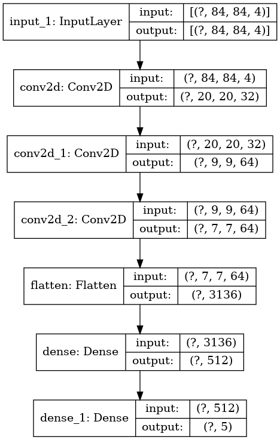

### Deep Q Learning

### Double Deep Q Learning

Nous avons ensuite amélioré notre modèle en ajoutant un réseau "target" pour que l'apprentissage soit plus stable.

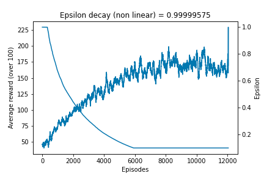

#### Nouvelle politique de récompense

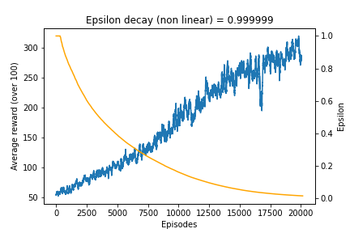

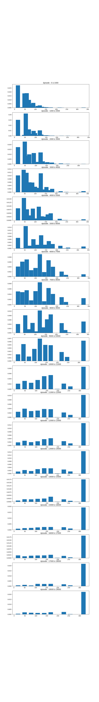
