# New Super Mario Mario 3D Q

[[_TOC_]]

Projet de Machine Learning pour l'apprentissage de Super Mario Bros par des méthodes de renforcement.

## L'apprentissage par renforcement

L'apprentissage par renforcement est une méthode de Machine Learning très différente des approches classiques. En effet, là où les apprentissages (supervisés ou non) ont besoin de données d'entraînement, les algorithmes de Reinforcement Learning apprennent tout seul à partir de leur environnement.

L'un des exemples les plus connus est l'algorithme AlphaGo développé par Google DeepMind qui a appris de lui-même à jouer au jeu de go qui est un jeu très complexe. En 2016 AlphaGo a même été capable de surpasser de loin Lee Sedol considéré alors comme étant le meilleur joueur au monde du jeu de go (les matchs opposant Lee Sedol à AlphaGo sont visibles [ici](https://www.youtube.com/watch?v=vFr3K2DORc8)).

Les algorithmes de renforcement peuvent donc devenir très performants sur des jeux dont les règles sont très compliquées. On pourrait donc facilement imaginer son application à des problèmes réels.

Comme énoncé précédemment, l'apprentissage par renforcement consiste à apprendre à un agent à se comporter dans un environnement. Il sera récompensé s’il fait une bonne action et pénalisé dans le cas contraire. Ce mode de fonctionnement est très proche de ce que nous faisons dans la vie de tous les jours. Les données d'entraînement proviennent donc de l'environnement. Cet environnement peut être réel ou simulé. Par exemple, dans le cas d'AlphaGo, l'environnement d'entraînement a totalement été recréé virtuellement. Un exemple commun d'apprentissage dans un environnement réel est celui des voitures autonomes (un exemple très parlant d'apprentissage par renforcement dans un environnement réel pour apprendre à conduire à une voiture est visible [ici](https://www.youtube.com/watch?v=eRwTbRtnT1I)). Les environnements virtuels sont en général plus pratiques, car l'apprentissage y est plus aisé et plus rapide, mais ils ne reproduisent pas forcément tous aspects du monde réel. Enfin, le but de l'apprentissage par renforcement n'est pas de minimiser une fonction d'erreur comme dans les méthodes de Machine Learning classiques, mais plutôt de maximiser le nombre de récompenses actuelles et futures.

L'agent est donc plongé dans un environnement et va être amené à prendre des décisions en fonction de cet environnement. À chaque fois que l'agent prend une décision, l'environnement va lui renvoyer un état (le nouvel état de l'environnement après que l'agent ai effectué son action) ainsi qu'une récompense. Cette récompense peut être positive (si l'action est bénéfique), négative (si l'action est néfaste), ou neutre (si l'action n'a pas de répercussions).

Les interractions entre l'agent et l'environnement peuvent être résumées de la sorte :

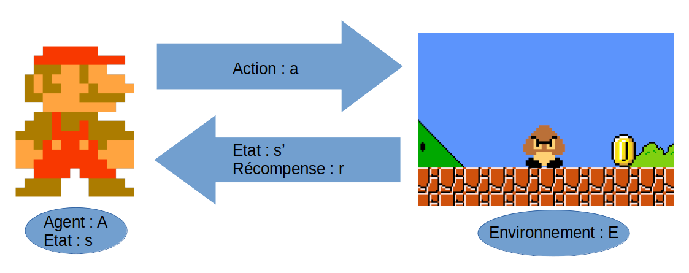

### Exemple simple

Voici un exemple très simpliste du principe de l'apprentissage par renforcement.

On considère un agent : Maro, et un environnement composé d'un Goombass (ennemi) et d'une pièce (objectif à atteindre).

Toute ressemblance avec des personnages ou des situations existantes ou ayant existé (notamment dans l'univers Nintendo) ne saurait être que fortuite.

Voici l'état initial :

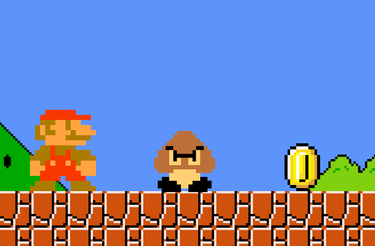

L'agent peut effectuer 3 actions distinctes :

- attendre.
- avancer vers la droite.
- sauter.

On définit les gains comme suit :

- -1 si Maro touche le Goomba.
- 1 si Maro atteint la pièce.
- 0 sinon.

L'objectif de l'agent est donc d'atteindre la pièce sans toucher le Goombass.

Dans un premier temps, on peut imaginer que l'agent va effectuer l'action "attendre" et donc ne pas bouger de son état initial, et donc obtenir un gain égal à **0**.

On considère ensuite que l'agent va avancer vers la droite :

|   Étape 1                                         |   Étape 2                                        |
|   :---------------------------------------------: |   :--------------------------------------------: |
|   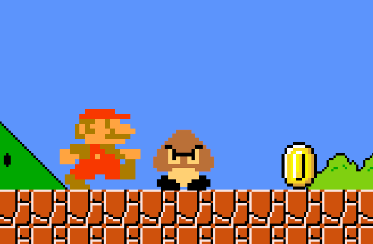   |   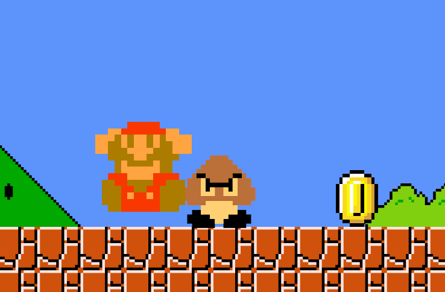  |

Maro va alors rencontrer le Goombass, et perdre une vie. L'environnement va donc lui renvoyer une récompense de **-1**.

Enfin, après avoir essayé les deux actions précédentes et n'ayant pas eu de retours fructueux, l'agent va essayer la troisième action possible, c’est-à-dire "sauter" :

|   Étape 1                                         |   Étape 2                                        |
|   :---------------------------------------------: |   :--------------------------------------------: |
|   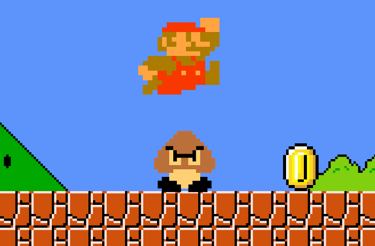   |   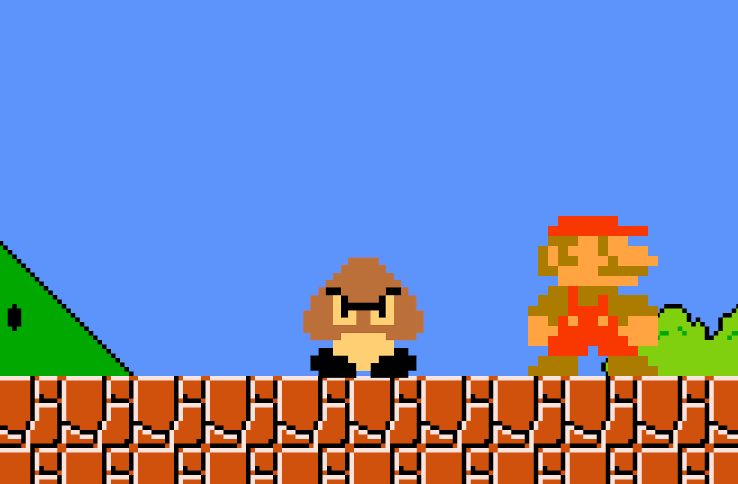  |

Cette fois-ci, Mario a réussi à atteindre la pièce, il reçoit donc une récompense égale à **1**.

À la suite de ces trois expériences, l'agent va privilégier l'action "sauter" car elle permet de maximiser le gain.

### Exploration vs exploitation

Les algorithmes d'apprentissage par renforcement possèdent deux phases différentes : la phase d'exploration et la phase d'exploitation.

Durant l'exploration, l'agent va prendre des actions aléatoires et noter les gains qu'il reçoit en effectuant ces différentes actions (ce qui s'apparente à la phase d'apprentissage).

Lors de l'exploitation, l'agent va effectuer les actions maximisant son gain à partir de ce qu'il a appris de ses explorations.

Cependant, il faut réussir à trouver un juste milieu entre l'explortion et l'exploitation. En effet, un algorithme ne faisant pas assez d'exploration pourrait se cantonner à une solution sous optimale, tandis qu'un algorithme ne faisant pas assez d'exploitation n'atteindrait jamais la solution.

Pour simplifier les choses, reprenons l'exemple de Maro.

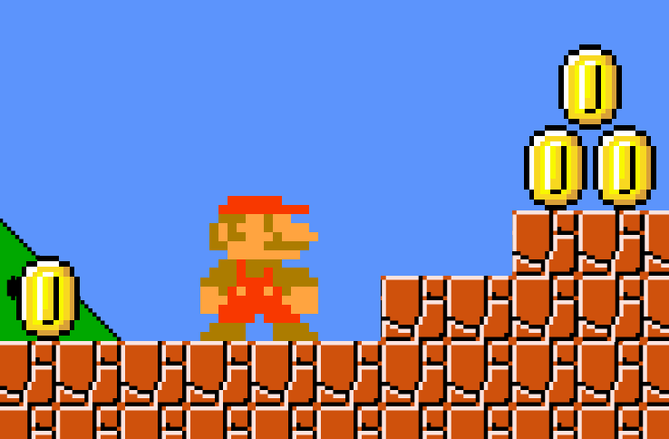

Cette fois-ci, Maro peut obtenir deux gains positifs : un gain de 1 s’il va à gauche et un gain de 3 s’il va à droite.

Si on fixe un nombre d'actions d'exploration petit, on pourrait imaginer que Maro va trouver la pièce de gauche (pour laquelle il lui suffit de se déplacer à gauche), mais ne va jamais atteindre celles de droite (car elles nécessitent plusieurs actions). Ainsi, lors de la phase d'exploitation, Mario va se contenter d'aller à gauche, ne maximisant pas son gain.

|   Solution sous-optimale      |   Solution optimale                                        |
| :--------------------------------------------------: | :--------------------------------------------: |
| 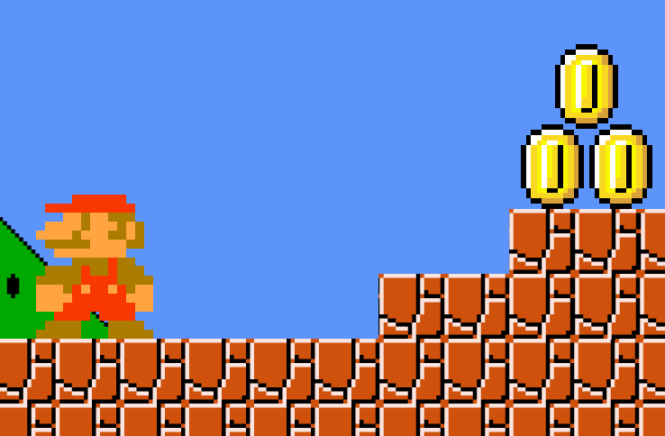 | 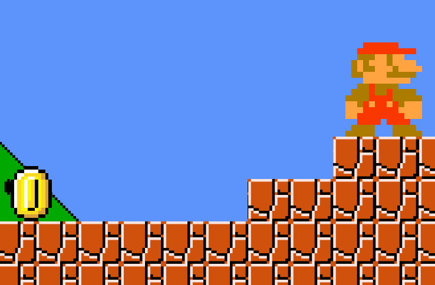 |

Ainsi, il existe plusieurs politiques d'exploration/exploitation.

La plus simple et aussi la moins efficace est la politique "greedy". L'agent va simplement choisir l'action maximisant son gain.

Une autre politique bien plus efficace est la politique nommée $`\epsilon`$-greedy. On fixe une valeur $`\epsilon`$ qui va représenter la proportion d'exploration. Par exemple, si on fixe $`\epsilon=0.9`$, on va faire 90 % d'exploration et 10 % d'exploitation.

Enfin, une autre politique très utilisée est nommée "decaying $`\epsilon`$-greedy". Le principe est exactement le même que pour la politique $`\epsilon`$-greedy, seulement, au bout d'un certain temps, on va faire diminuer petit à petit la valeur de $`\epsilon`$ pour arriver à un stade où l'on fait majoritairement de l'exploitation. Par exemple, on pourrait imaginer qu'on commence avec $`\epsilon=0.9`$ et qu'au bout du 100ᵉ épisode on commence à diminuer cette valeur de $`0.01`$ à chaque épisode jusqu'à ce que $`\epsilon=0.1`$.

### Value function

Pour savoir quelle action doit choisir l'agent en fonction de l'état de son environnement, il faut calculer la valeur de ces états. Cette valeur est calculée grâce à la value function.

La définition de cette value function dépend des algorithmes de Reinforcment Learning.

## L'algorithme Q-Learning

L'algorithme du Q-learning est l'un des algorithmes de renforcement les plus utilisé. Son nom vient de la fonction d'évaluation qui lui es associée : la Q-function.

### La Q-function

La Q-function mesure la qualité d'une action dans un état de l'environnement. Elle prend donc en paramètre l'état, mais aussi l'action que l'agent va effectuer.

Elle est définie de la sorte :

```math
Q(s_t, a_t)^{\pi} = \mathbb{E}[r_{t+1} + \gamma r_{t+2} + \gamma ^2 r_{t+3} + ...|s_t, a_t]
```

Avec :

- $`s_t`$ : l'état de l'environnement à l'instant $`t`$.
- $`a_t`$ : l'action choisie à l'instant $`t`$.
- $`r_{t}`$ : la récompense à l'instant $`t`$.
- $`\gamma \in [0, 1]`$ : un facteur représentant à quel point on va prêter de l'importance aux récompenses sur le long terme (si $`\gamma \approx 1`$ on accorde autant d'importance aux récompenses futures qu'aux récompenses actuelles).
- $`\pi`$ : veut dire que l'agent choisi l'action optimale.

On utilise l'espérance $`\mathbb{E}`$ afin de faire une moyenne, car l'environnement n'est pas forcément déterministe et peut varier au cours des expériences.

La valeur de la Q-function pour une action et un état donné est donc une moyenne des différentes récompenses possibles futures.

### Q-function récursive

On peut redéfinir l'équation précédente de manière récursive avec l'équation de Bellman :

```math
Q(s_t, a_t)^{\pi} = r + \gamma max_{a_{t+1}} Q(s_{t+1}, a_{t+1})^{\pi}
```

Avec :

- $`r`$ : la récompense obtenue en prenant l'action $`a_t`$ dans l'état $`s_t`$.
- $`\gamma`$ : de même que précédement.
- $`max_{a_{t+1}} Q(s_{t+1}, a_{t+1})`$ : la valeur maximale de la Q-function à l'état $`t+1`$ en fonction de l'action.

Cette équation est plus utile car définie de manière récursive.

### Update function

Au cours de l'apprentissage, on veut mettre à jour la valeur de cette Q-function. Pour cela, on utilise donc une fonction d'update qui est définie de la sorte :

```math
Q(s_t, a_t)_{new} = Q(s_t, a_t)_{old} + \alpha [r + \gamma max_{a_{t+1}}Q(s_{t+1}, a_{t+1}) - Q(s_t, a_t)_{old}]
```

Avec :

- $`max_{a_{t+1}}Q(s_{t+1}, a_{t+1}) - Q(s_t, a_t)_{old}`$ : la différence entre la valeur de la prochaine action (au temps $`t+1`$) et la valeur de l'action actuelle.
- $`\gamma`$ : de même que précédemment.
- $`r`$ : de même que précédemment.
- $`\alpha`$ : le learning rate (afin de pouvoir moyenner cette modification sur plusieurs expériences).

Ainsi, les valeurs de la Q-function sont mise à jour au cours des expériences de manière rétroactive. Une fois qu'un agent a atteint un gain, ce gain va se propager dans les états précédents.

L'algorithme de Q-learning est très pratique et très performant pour résoudre de simples problèmes d'apprentissage par renforcement (sur des jeux simples). En revanche, il n'est pas suffisant pour résoudre des problèmes plus compliqués (comme des jeux vidéos style 8-bits).

### Le Q en pratique

En pratique la Q-function se base sur un tableau que nous nommons Q-table. Dans ce tableau sont stockés les différentes transitions d'états sous la forme de tuples :

```math
\text{transition} = (s_t, a, r, s_{t+1})
```

- $`s_t`$ l'état initial
- $`a`$ l'action effectuée
- $`r`$ la récompense obtenue
- $`s_{t+1}`$ l'état final

### Exemple du Q

On reprend l'exemple ci-dessous avec comme actions possibles "aller à droite", "sauter" et "attendre". Et avec des gains de 1 et -1 respectivement pour la pièce et le Goombass. On choisit arbitrairement $`\gamma=0.9`$


On peut alors imaginer, qu'au terme de la phase d'apprentissage, la valeur de l'action "sauter" sera très proche de 1, car elle permet d'obtenir un gain de 1. De même, la valeur de l'action "aller à droite" aura une valeur proche de -1.

L'action "attendre" en revanche aura une valeur de $`0 + \gamma \times 1 = 0.9`$. En effet, la valeur du gain de l'action "attendre" est de 0. Le gain potentiel maximum de la prochaine action est lui égal à 1 (correspondant à l'action sauter).

### Limitations du Q-Learning

La mise en œuvre du Q-learning nécessite de construire un tableau associant les différentes transitions possibles ainsi que l'espérance des récompenses associées. En effet, on estime la Q-function en actualisant le tableau à chaque itération à l'aide de l'équation de _Bellman_.

Cependant, lorsque l'environnement devient trop complexe les nombre de transitions possibles augmente considérablement. Ainsi construire un tableau devient contre-productif puisqu'il serait trop lourd à stocker en mémoire.

C'est pour cela qu'une amélioration de la méthode a été proposée pour pouvoir s'appliquer à des environnements plus complexes.

## Le Deep Q-Learning

Dans l'[article suivant](https://arxiv.org/pdf/1312.5602.pdf) une méthode de Deep Learning est proposée pour régler le problème du Q-learning classique. Ainsi, le Deep Q-Learning permet d'entraîner un agent sur des environnements sur des complexes, comme des jeux vidéos.

### Principe général

L'idée présentée dans cette article se base sur la combinaison du principe du Q-learning avec la puissance des réseaux de neurones dans le but d'entraîner un agent a jouer à des jeux Atari.

Ainsi, l'objectif ici est de pouvoir approximer la Q-function avec un réseau de neurone.

### Problème à résoudre

En entrée du réseau, nous avons l'état actuel du jeu. Nous souhaitons obtenir l'espérance des récompenses en sortie pour chaque action qu'il est possible de réaliser. En somme, nous voulons d'approcher la Q-function.

L'objectif de l'agent est donc d'interagir avec un environnement (ici l'émulateur de jeu) en sélectionnant des actions pour maximiser les récompenses qu'il peut obtenir. Nous définissons $`Q^*(s_{t}, a_{t})`$ la valeur maximale des récompenses futures espérées en suivant n'importe quelle stratégie après avoir pris connaissance de l'état de l'environnement $`s`$. L'agent choisit ensuite une action $`a`$. Ainsi :

```math
Q^*(s_{t}, a_{t}) = \max_\pi \mathbb{E}[R_t | s_t = s, a_t = a, \pi]
```

avec $`R_t`$ les récompenses futures.

Ainsi, nous nous basons sur l'équation de _Bellman_ pour construire notre objectif. Si la valeur optimale $`Q^*(s_{t+1}, a_{t+1})`$ à l'état suivant $`s_{t+1}`$ est connue pour toutes les actions $`a_{t+1}`$ possibles alors la stratégie optimale est de sélectionner l'action $`a_{t+1}`$ qui maximise la valeur des récompenses espérées : $`r+\gamma Q^*(s_{t+1}, a_{t+1})`$ avec $`\gamma`$ le coefficient d'actualisation des récompenses futures.

```math
Q^*(s_{t}, a_{t}) = r + \gamma \max_{a_{t+1}} Q^*(s_{t+1}, a_{t+1})
```

Nous utilisons donc un réseau de neurone que nous appellerons Q-network pour servir d'estimateur de cette fonction. La fonction de perte est définie de la manière suivante :

```math
L_i (\theta_i) = (y_i - Q(s, a; \theta_i))^2
```

avec $`y_i`$ la _target_ telle que :

```math
y_i = r + \gamma \max_{a_{t+1}} Q(s_{t+1}, a_{t+1}; \theta_{i-1})
```

et notre _feature_:

```math
x_i = Q(s, a; \theta_i)
```

avec $`\theta`$ faisant référence aux poids du réseau de neurones.

### Algorithme

L'algorithme présenté par *DeepMind* illustrant la procédure d'apprentissage de l'agent est le suivant :

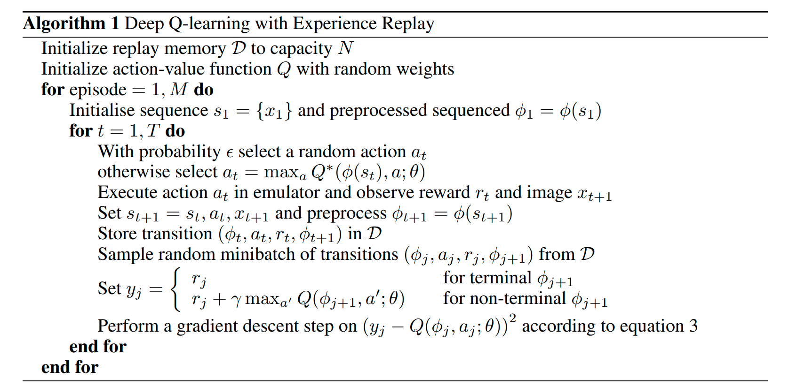

Ici, le principe d'**experience replay** est utilisé pour constituer une base de données de transitions. Lors de l'apprentissage à chaque pas effectué par l'environnement la transition entre l'état actuel et l'état suivant est stockée dans un buffer. À chaque pas d'apprentissage le modèle va apprendre sur un batch de transitions échantillonné depuis ce buffer. Cela permet d'éviter les corrélations entre les données successives fournies au modèle durant l'apprentissage.

### Limitations

Le principal problème du Deep Q-learning réside dans sa procédure d'apprentissage très instable. En effet, le même modèle d'estimation de la Q-function est utilisé pour générer les _features_ et les _targets_. Cela signifie que la fonction de perte change à chaque itération. De plus, avec cette méthode le réseau a tendance à surestimer les valeurs (à cause notamment de l'utilisation de l'opérateur **max**) ce qui peut mener l'agent à s'enfermer plus facilement dans des comportements sous optimaux.

## Le Double Deep Q-Learning

Afin de pallier le problème engendré par le deep Q-learning, on peut utiliser une amélioration de cette méthode : le Double Deep Q-learning. Son principe est détaillé dans l'article [Deep Reinforcement Learning with Double Q-learning](https://arxiv.org/pdf/1509.06461.pdf).

### Le Double Q-Learning

Le Double Deep Q-Learning s'inspire d'une méthode appelé le Double Q-Learning. Le principe du Double Q-Learning consiste simplement à utiliser deux Q-functions. Ainsi, à chaque épisode, les poids d'une des deux fonctions (choisie de manière aléatoire) vont être mis à jour, créant deux jeux de poids notés $`\theta`$ et $`\theta'`$.

Les _targets_ seront donc de la forme :

```math
y_t^{DoubleQ} = r_{t+1} + \gamma Q\left(S_{t+1}, \max_a Q\left(S_{t+1}, a; \theta_t\right); \theta_t' \right)
```

On retrouve bien ici deux Q-functions :

- Une première fonction (celle associé au modèle $`\theta`$) permet de sélectionner l'action optimale pour un état donné. On dit que c'est la fonction _online_.
- Une seconde fonction (celle associé au modèle $`\theta'`$) permet de calculer les récompenses attendues par l'utilisation de cette action pour le même état. On dit que c'est la fonction _target_.

Cette séparation permet d'obtenir une évaluation plus stable, en limitant la surévaluation des récompenses.

### Application du Double Q-Learning pour le Double Deep Q-Learning

Le Double Deep Q-Learning utilise les avantages du Deep Q-Learning, tout en rendant l'apprentissage plus stable en utilisant le Double Q-Learning.

Le principe est ici le même que pour le Double Q-Learning. Au lieu d'utiliser un seul Q-network, on utilisera deux Q-networks : un _online_ pour le choix de la meilleure action et un _target_ pour le calcul des valeurs de récompenses.

La principale différence avec le Double Q-Learning, est l'apprentissage des deux réseaux. Là où dans le Double Q-Learning, les deux fonctions jouaient un rôle symétrique et interchangeable, le Double Deep Q-Learning sépare l'apprentissage des deux réseaux :

- Le réseau _online_ est mis à jour à chaque itération.
- Le réseau _target_ est une copie du réseau _online_, toutes les `$\tau$` itérations. Ce réseau correspond donc à une version plus ancienne du réseau _online_.

Cette séparation permet d'améliorer la stabilité de l'apprentissage du Q-network.

## Présentation de nos expérimentations

### Présentation de l'environnement

L'environnement utilisé est disponible à cette adresse : [gym-super-mario-bros](https://pypi.org/project/gym-super-mario-bros/)

Cet environnement implémente l'interface `Environnement` de la bibliothèque [gym](https://gym.openai.com/). Pour faire progresser l'environnement la fonction `step` est utilisée (on lui envoie en paramètre une action à réaliser). Cette fonction renvoie ainsi :

- **state** : le nouvel état du jeu, ici, c'est une image du jeu en RGB.
- **reward** : les récompenses obtenues suite à l'action effectuée.
- **done** : vrai si le niveau est terminé, faux sinon mario est mort.
- **infos** : un dictionnaire contenant des informations sur le déroulement du jeu telles que,
  - **coins** : les pièces collectées par l'agent.
  - **flag_get** : booléen indiquant si le drapeau ou la hache ont été atteint (si l'agent a complété le niveau).
  - **life** : le nombre de vies restantes de mario.
  - **score** : le score actuel de l'agent.
  - **stage** : l'identifiant du niveau.
  - **status** : le status de mario (si il est petit, grand ou en fleur de feu).
  - **time** : le temps en jeu.
  - **world** : l'identifiant du monde.
  - **x_pos** : la position en x de mario sur le niveau.
  - **y_pos** : la position en y de mario sur le niveau.

En plus de cela, l'environnement propose différents ensembles de mouvements. Ces ensembles de mouvements permettent de limiter le choix d'actions réalisables par l'agent. Cela permet notamment d'obtenir un certain contrôle sur la complexité de l'environnement. Lors de nos expérimentations, nous utiliserons principalement l'ensemble de mouvement : `RIGHT_ONLY` qui limite les mouvements de l'agent à un déplacement vers la droite.

#### La politique de récompense

Une politique de récompense par défaut est définie par l'environnement :

##### La vélocité

$`v`$ : la différence entre la position en x de mario à l'état initial et à l'état suivant selon la relation $`v = x_{t+1} - x_{t-1}`$.

Ainsi lorsque mario :

- va vers la droite (vers la fin du niveau) : $`v > 0`$
- va vers la gauche : $`v < 0`$
- ne bouge pas : $`v = 0`$

Cette composante de la fonction de récompense a pour objectif de stimuler le déplacement de l'agent vers la fin du niveau.

##### La composante temporelle

$`c`$ : la différence entre le temps ingame à l'état initial et à l'état suivant selon la relation $`c = c_{t+1} - c_{t-1}`$.

Cette composante de la fonction de récompense a pour objectif d'imposer une contrainte de temps à l'agent pour pouvoir finir le niveau. Ainsi, l'agent est encouragé à finir le niveau le plus rapidement possible.

##### La peine de mort

$`d`$ : la pénalité appliquée à l'agent s'il meurt.

Ainsi lorsque mario :

- est vivant : $`d = 0`$
- meurt : $`d = -15`$

##### Total

L'expression finale de la fonction de récompense est la suivante :

```math
r = v + c + d
```

### Architecture du modèle

Notre objectif est de pouvoir calculer l'espérance des récompenses futures à partir d'un état du jeu.

Comme préconisé dans [Playing Atari with Deep Reinforcement Learning](https://www.cs.toronto.edu/~vmnih/docs/dqn.pdf) nous fournirons à notre modèle 4 images en nuances de gris de taille $`84 \times 84`$ empilées (images allant des temps $`t-3`$ à $`t`$).

Afin de pouvoir analyser ces images, nous utilisons 3 couches de convolution et nous complétons l'architecture avec 1 couche dense.

Finalement nous ressortons un vecteur indiquant l'espérance des récompenses futures pour chaque action possible.

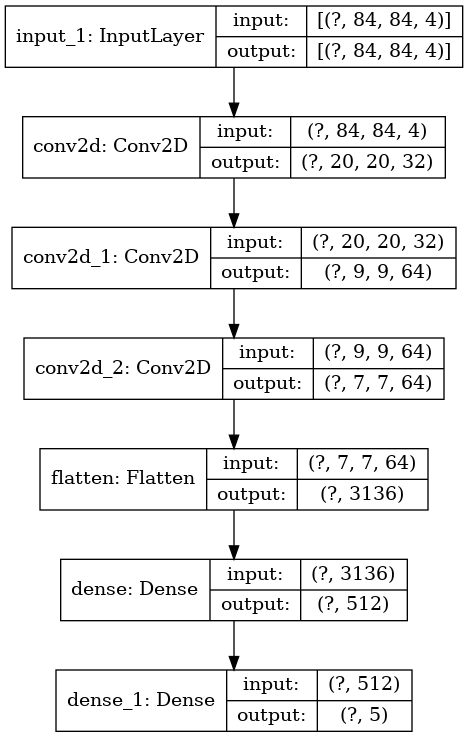

### Preprocessing

Nous utiliserons les wrappers recommandés par *DeepMind* pour apprendre sur des jeux Atari :

- MaxAndSkip : Saute un certain nombre d'images et réalise un max-pooling sur celles-ci. Cela permet donc d'explorer plus de situations différentes.
- WarpFrame : Redimensionne l'image du jeu en taille $`84 \times 84`$ et la passe en nuance de gris.
- FrameStack : Modifie la forme de l'état ressorti par la fonction step de l'environnement. Cet état sera constitué de 4 images consécutives.
- ScaledFloatFrame : Réduit les nuances de gris entre 0 et 1.

### Deep Q Learning

### Double Deep Q Learning

#### Premières expérimentations

Dans un premier temps l'objectif de nos premières expérimentations est de réussir à aller le plus loin possible dans le premier niveau de _Super Mario Bros._ (niveau **1-1**).

Ici nous utiliserons en plus le wrapper : `ClipReward` qui permet de borner les récompenses unitaires données par l'environnement entre -1 et 1. Nous utiliserons une politique $`\epsilon`$-greedy.

La récompense totale obtenue par l'agent en cas de victoire sur le niveau 1-1 est environ égale à 300.

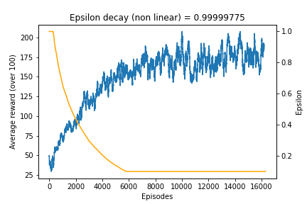

Nous pouvons constater qu'au fur et à mesure de la diminution du coefficient d'exploration $`\epsilon`$ la récompense moyenne augmente. Les histogrammes de densité de récompense en fonction des épisodes sont visibles en [annexe](#avec-clipreward).

Lors de l'apprentissage (environ 20 heures sur les machines du CRIANN) nous avons extrait différents modèles. On propose ici les vidéos des parties jouées par ces modèles :

- Episode 0 :


- Episode 1000 :


- Episode 5000 :


- Episode 9000 :


- Episode 16000 (signes de progression) :


- Résultat exceptionnel (Episode 14000 : finis le niveau) :


Nous pouvons constater que Mario va de plus en plus loin dans le niveau, mais l'agent semble ne pas chercher à finir le niveau. L'expérience est concluante puisque nous pouvons constater que l'agent a appris. Cet apprentissage n'est complètement satisfaisant.

Nous avons donc essayer de faire varier les hyper-paramètres.

#### Nouvelle politique de récompense

Ici nous utiliserons en plus le wrapper : `CustomReward` à la place de `ClipReward`.

Ce changement de wrapper modifie la manière de calculer les récompenses. Ainsi nous reprenons la même politique qu'auparavant (sans le `ClipReward`) en ajoutant une récompense plus importante à l'agent lorsque ce dernier touche le drapeau. La fonction d'attribution devient :

```math
r_\text{new} = (r_\text{old} + r_\text{drapeau})/10
```

avec $`r_\text{drapeau} = 400`$ si le niveau est terminé (drapeau ou hache atteinte) et $`r_\text{drapeau} = -15`$ sinon.

La récompense totale obtenue par l'agent en cas de victoire sur le niveau 1-1 est environ égale à 300.

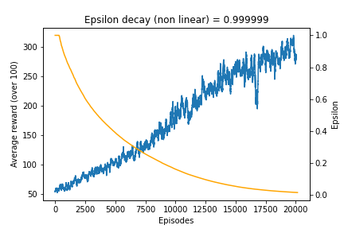

Nous pouvons constater que la récompense moyenne sur 100 épisodes consécutifs augmente graduellement au fur et à mesure que le coefficient d'exploration $`\epsilon`$ diminue. C'est un signe que notre agent parvient à se familiariser avec l'environnement pour aller de plus en plus loin.

Les histogrammes de densité de récompense en fonction des épisodes sont visibles en [annexe](#avec-customreward).

Nous constatons qu'au fur et à mesure de l'apprentissage la proportion des épisodes ayant une récompense totale supérieure à 300 augmente et vient s'imposer par rapport aux autres tranches possibles. En fin d'entraînement (lorsque le coefficient d'exploration $`\epsilon`$ est suffisamment bas pour considérer que l'agent est complètement libre de ses mouvements), les épisodes ayant une récompense totale supérieure à 300 sont majoritaires.

Lors de l'apprentissage (environ 40 heures sur les machines du CRIANN) nous avons extrait différents modèles et généré des vidéos pour illuster les performances de l'agent :

- Episode 0 :


- Episode 1000 :


- Episode 5000 :


- Episode 13000 (Finis le niveau, mais encore hésitant) :


- Episode 20000 (Perfect stairs) :


Nous pouvons constater la progression de l'agent lors du processus d'apprentissage. Le fait de donner plus d'importance au fait de finir le niveau semble avoir permis à l'agent d'évoluer vers le comportement souhaité.

Nous pouvons en conclure que notre agent a bien réussi à apprendre comment terminer le niveau 1-1 de _Super Mario Bros._.

#### Passage sur le niveau 1-4

Nous avons également testé notre algorithme d'apprentissage (environ 30 heures sur les machines du CRIANN) avec un ensemble de mouvements plus compliqué (`SIMPLE_MOVEMENT`) sur un niveau différent : le _1-4_.

- Episode 40000 :


#### Passage sur le niveau 1-3

On réalise la même expérience sur le niveau _1-3_.

- Episode 49800 :


On peut noter que ce niveau est bien plus difficile que ceux testées précédemment.

### Critique sur le travail réalisé

À cause du temps d'apprentissage plutôt long nous n'avons pu réaliser autant d'expériences que nous aurions souhaités. Ainsi, notre progression était plutôt lente : il a fallu tester de nombreuses variations d'hyper-paramètres avant d'aboutir à un résultat satisfaisant.

### Perspectives d'amélioration

Il reste encore beaucoup de possibilités à explorer. Nous pourrions par exemple lancer l'apprentissage sur tous les niveaux du premier monde à la suite. Ainsi, un seul agent pourrait réussir à synthétiser tous les concepts dans _Super Mario Bros._.

De plus, nous pourrions essayer d'autres structure pour le Q-network. On pense par exemple à utiliser des réseaux récurrents. On pourrait alors améliorer les performances du modèle ou accélerer l'apprentissage.

Enfin, nous avons testé un très simple se basant sur quelques de valeurs issues de la RAM (position de mario, et des ennemies), mais les résultats n'ont pas été concluant. Il semble que nous ne fournissons pas assez d'informations sur l'environnement au modèle. Nous pourrions imaginer à l'avenir d'utiliser plus de valeurs issues de la RAM afin de savoir si ce type d'agent peut être plus performant que ceux utilisant des images d'images. Cette méthode aurait l'avantage d'avoir des entrées bien plus petites.

### Graphiques annexes

#### Histogrammes de densité des récompenses

##### Avec ClipReward

**Epsilon** = 0.99999775

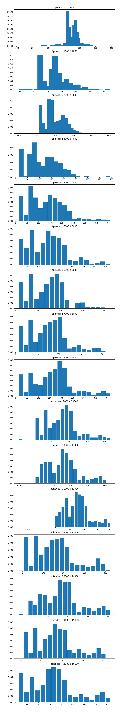

##### Avec CustomReward

**Epsilon** = 0.999999

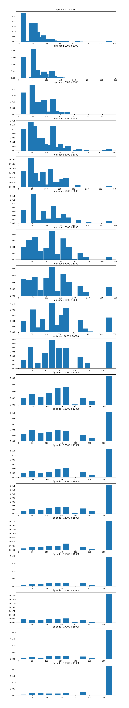
